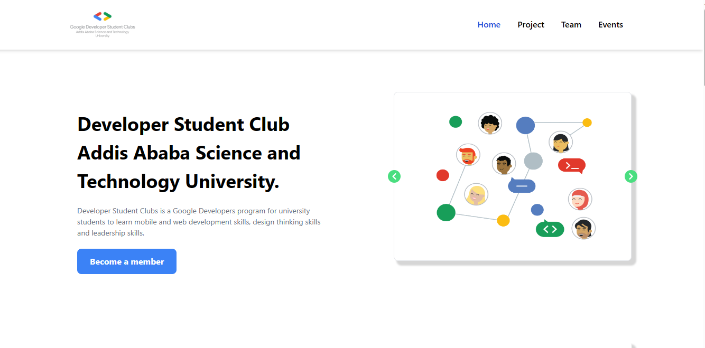

# GDSC Main Site Development Project

This repository contains the source code for the development of the Google Developers Students Clubs (GDSC) main site. The main objective of this project is to promote the club and provide information on the club's activities for visitors. The site is built using React.js for the front-end and Node.js for the back-end, including a REST API.

## Contributors

1. [Wubshet Zeleke](https://github.com/wubeZ) - Back-End Developer
2. [Aser Hailu](https://github.com/asero13th) - Front-End Developer
3. [Yoseph Shemeles](https://github.com/jossyfresh) - Front-End Developer
4. [Tinsaye Simeneh](https://github.com/tinsaye-simeneh) - UI Designer
5. [Gemechis Elias](https://github.com/gemechis-elias) - Project Manager/ Developer

## Screenshots

### Home Page



## Technologies Used

- Front End: React.js
- Back End: Node.js, REST API

## Installation

To set up the development environment for the GDSC Main Site project, follow these steps:

1. Clone the repository:

   ```bash
   git clone https://github.com/gdscaastu/gdsc-main-site.git
   ```

2. Install the required dependencies for the front-end and back-end:

   ```bash
   cd gdsc-main-site
   npm install
   ```

3. Start the development server:

   ```bash
   npm start
   ```

   This will run the front-end React development server.

4. To start the back-end server, navigate to the `backend` directory and run:

   ```bash
   cd backend
   npm install
   npm start
   ```

   The back-end server will start running, providing the necessary API endpoints.

## Contributing

Contributions are welcome! If you'd like to contribute to the GDSC Main Site project, please follow these steps:

1. Fork the repository.
2. Create a new branch for your feature or bug fix: `git checkout -b my-new-feature`.
3. Make your changes and commit them: `git commit -am 'Add some feature'`.
4. Push the changes to your fork: `git push origin my-new-feature`.
5. Submit a pull request explaining your changes.

Please make sure to adhere to the [code of conduct](CODE_OF_CONDUCT.md) when contributing to this project.

## License

This project is licensed under the [MIT License](LICENSE). Feel free to use, modify, and distribute this code as per the terms of the license.

## Contact

If you have any questions, feel free to reach out to the project maintainer:

- gdscaastu@gmail.com

Thank you for your interest in the GDSC Main Site project. We appreciate your contributions and support!
